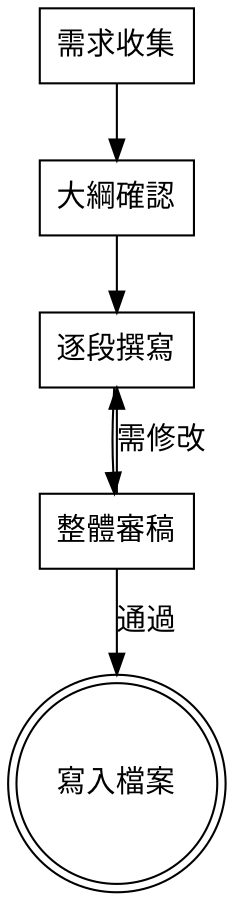

<HARD-GATE>
在完成「需求收集」階段之前，不得開始撰寫任何內容。
必須先確認主題、目標讀者、Hook、技術細節後，才能進入大綱階段。
</HARD-GATE>

## 概述

這個 SKILL 引導你寫一篇技術部落格文章，遵循 `src/content/docs/blog/_template.md` 的 5 段式結構。

### 流程一覽



### 中斷恢復

如果對話中斷，重新載入此 SKILL 時先確認上次進度：

1. 檢查已經完成到哪個階段
2. 已確認的段落內容保留，不需重新產生
3. 從中斷處繼續

### 多語言支援

開始前先詢問使用者：**「這篇文章要寫中文還是英文？」**

- 中文：日期格式使用 `zh-TW` locale，文章用語為繁體中文
- 英文：日期格式使用 `en-US` locale，文章用語為英文

預設為中文。

## 階段 1：需求收集

一次問一個問題，引導使用者聚焦。等使用者回答後再問下一題。

問題清單（依序提問）：

1. **主題**：今天要寫的主題是什麼？請用一句話描述。
2. **目標讀者**：這篇文章是寫給誰看的？（例如：前端初學者、後端工程師、DevOps 團隊）
3. **Hook**：為什麼這件事值得今天花時間寫？讀者為什麼要關心？
4. **技術細節**：有沒有具體的：
   - 踩坑經驗（原本怎麼寫 → 出什麼錯 → 怎麼修）
   - 設計決策（A 方案 vs B 方案的取捨）
   - 關鍵技巧（學到一個好東西/技巧）

收集完後，簡短總結給使用者確認。

## 階段 2：大綱確認

根據需求收集的結果，產生完整的 5 段式大綱。格式如下：

```markdown
## 大綱

**Hook（鉤子）**
一句話：<擬寫的 hook>

**Context（背景與動機）**
- <預計要寫的背景 1>
- <預計要寫的背景 2>

**Practice（核心實作）**
- 採用 <踩坑型 / 推導型 / 關鍵技巧型> 寫法
- 預計展示的關鍵程式碼：<簡述>

**Reflection（練習後反思）**
- <預計要寫的反思點>

**Next Step（下一步）**
- <預計的收尾方向>
```

請使用者確認或修改大綱。**通過後才能進入階段 3**。

## 階段 3：逐段撰寫

依序撰寫每一段。**寫完一段 → 使用者確認 → 再寫下一段。**

### 寫作規範（參考 _template.md）

- 總長度：讀完約 3~5 分鐘（約 800~1500 字）
- 不含程式碼的純文字大約 600~1000 字
- 程式碼區塊 1~3 段，每段不超過 20 行
- 每多一段程式碼，就要多一段文字解釋
- Practice 段落為全文 50~60%

### Hook（鉤子）— 1~2 句

不說「我今天學了 X」，而是說「為什麼這件事值得今天花時間」。讓讀者一秒共鳴。

### Context（背景與動機）— 3~5 句

說明原本遇到的問題、為什麼選這個主題來練。可寫：
- 之前卡關的點
- 看到誰的文章/影片/專案受到啟發
- 這次練習想驗證什麼假設

### Practice（核心實作）— 全文 50~60%

從大綱確認的三種寫法中選一種，嚴格遵守：

- **不要貼完整檔案**，只貼最關鍵的 5~15 行程式碼
- **每段程式碼前面一定要有一句話解釋**「這段在做什麼」
- **程式碼後面一定要有一句話解釋**「這樣做的好處是什麼」

推薦節奏：文字解釋問題 → 程式碼區塊 → 一句話總結 → 文字解釋下一步 → 程式碼區塊 → 一句話總結

### Reflection（練習後反思）— 3~5 句

做完之後的感覺，跟預期有哪裡不一樣。可寫：
- 這個方法比想像中難/簡單的地方
- 過程中發現自己原本的盲點
- 跟網路上教學文說的哪裡一致、哪裡不同

這是「故事性」的靈魂——讀者不是來看標準答案，是來看你的思考過程。

### Next Step（下一步）— 2~3 句

收在「未完待續」的感覺。暗示你是有計劃地在進步，不是隨興所至。
