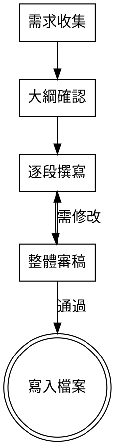

# Writing Blog Posts SKILL 設計規範

## 目標

在專案 `.opencode/skills/writing-blog-posts/SKILL.md` 建立一個可重複使用的代理技能，引導使用者遵循 `src/content/docs/blog/_template.md` 的 5 段式結構撰寫技術部落格文章。

## 存放位置

- SKILL 檔案：`.opencode/skills/writing-blog-posts/SKILL.md`
- 參考模板：`src/content/docs/blog/_template.md`（分離式，不內嵌）

## SKILL 基本資訊

- 名稱：`writing-blog-posts`
- 描述：引導使用者撰寫結構化的技術部落格文章，遵循 5 段式模板（Hook → Context → Practice → Reflection → Next Step）。透過互動式問答收集需求，逐段撰寫，最後自動寫入 `src/content/docs/blog/`。

## 適用範圍

- 一次只處理一篇部落格文章
- 不涵蓋圖片上傳、SEO 優化、社交分享

## 五階段流程

### 階段 1：需求收集

AI 逐一詢問以下問題（一次一題），引導使用者聚焦：

- 今天要寫的主題是什麼？（一句話）
- 這個主題的目標讀者是誰？
- 為什麼這個主題值得寫？（Hook 靈感）
- 有沒有具體的技術細節／踩坑經驗／設計決策要分享？

### 階段 2：大綱確認

AI 根據需求產生完整的 5 段式大綱，包括每段預計要寫的關鍵內容，讓使用者確認後才往下。

### 階段 3：逐段撰寫

依 Hook → Context → Practice → Reflection → Next Step 順序，寫完一段讓使用者確認後再寫下一段。Practice 階段特別要求：

- 只貼關鍵程式碼（5~15 行）
- 每段程式碼前後都要有文字解釋

### 階段 4：整體審稿

寫完後 AI 對照 `_template.md` 的檢查清單自我檢查：

- 鉤子能否引起共鳴？
- 核心實作有「原本以為 → 後來發現」的轉折嗎？
- 程式碼有被文字解釋包圍嗎？
- 反思有誠實寫出跟預期不一樣的地方嗎？
- 全文只講一個主題嗎？

### 階段 5：寫入檔案

- AI 自動產生完整 frontmatter（title、description、date、tags、author、summary、related、isBlog、draft）
- 以 `draft: true` 產生
- 檔名 slug 由 title 自動產生（例如 `my-first-post.md`）
- 寫入 `src/content/docs/blog/<slug>.md`

## SKILL.md 內容結構

### Frontmatter

```yaml
---
name: writing-blog-posts
description: 引導使用者撰寫結構化的技術部落格文章...
---
```

### 主體內容

1. **HARD-GATE 提醒** — 未完成需求收集前不得開始寫內容
2. **流程說明** — 5 階段流程，含每個階段的具體動作與完成條件
3. **Frontmatter 規則** — 自動產生的欄位規則（title slug 化規則、日期用當天、tags 格式、related 預設空陣列、draft: true）
4. **寫作規範** — 從 `_template.md` 提煉的核心原則（字數建議 800~1500 字、程式碼 5~15 行、每段程式碼前後需有文字等）
5. **檢查清單** — 審稿階段使用的 5 題檢查清單
6. **檔案寫入規則** — slug 產生規則、`src/content/docs/blog/` 路徑確認
7. **中斷恢復** — 如果使用者在某個階段中斷對話，下次啟動 SKILL 時能從中斷處繼續（透過 task_id）
8. **多語言支援** — 文章可選中文或英文撰寫，影響日期格式、用語等

### 與模板的關係

不內嵌 `_template.md` 內容。流程中指示 AI 參閱 `src/content/docs/blog/_template.md` 取得段落結構細節。模板更新時 SKILL 無需修改（除非流程或規範變動）。

## 寫作規範（提煉自 _template.md）

- 總長度：讀完約 3~5 分鐘（約 800~1500 字）
- 不含程式碼的純文字大約 600~1000 字
- 程式碼區塊 1~3 段，每段不超過 20 行
- 每多一段程式碼，就要多一段文字解釋
- Practice 段落為全文 50~60%
- 寫法三選一：踩坑型、推導型、關鍵技巧型

## Frontmatter 規則

| 欄位 | 規則 |
|------|------|
| title | 從使用者主題提煉 |
| description | 簡短描述，用於搜尋與摘要 |
| date | 當天日期 YYYY-MM-DD |
| tags | 從內容自動推斷，使用者可調整 |
| author | 從使用者提供或預設值 |
| summary | 首頁顯示的摘要，從內容摘要 |
| related | 預設空陣列 `[]` |
| isBlog | `true` |
| draft | `true` |

## 中斷恢復機制

- 每個階段完成時記錄當前階段到記憶中
- 重新載入 SKILL 時先確認上次進度，從中斷處繼續
- 已確認的段落內容保留，不需重新產生

## 多語言支援

- 文章可選中文或英文撰寫
- 影響日期格式（中文用 `zh-CN` locale、英文用 `en-US`）
- 影響文章中的用語風格
- 預設為中文

## 流程圖


